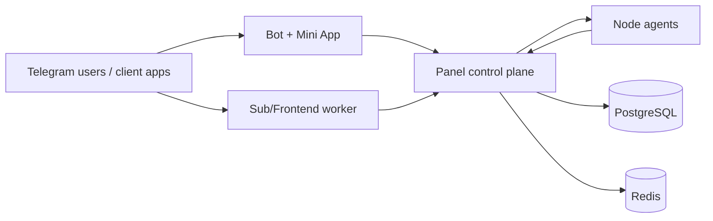

# CARAMBA

CARAMBA is an installer-first platform for operating censorship-resistant VPN infrastructure.

It combines a Rust control plane, distributed workers, node agents, and Telegram client surfaces into one operational system that can start simple (single host) and scale to distributed production.

## Install (One Command)

```bash
curl -fsSL https://raw.githubusercontent.com/semanticparadox/caramba/main/scripts/install.sh | sudo bash
```

This installs the `caramba` CLI, which becomes the single entrypoint for install, upgrade, diagnostics, backup restore, and uninstall.

## Why This Project Exists

Most VPN stacks fail in operations, not in protocol support: ad-hoc provisioning, inconsistent config rollout, weak observability, and painful upgrades.

CARAMBA solves that by standardizing the lifecycle:

- install and upgrade through one installer flow;
- panel-driven node onboarding and config orchestration;
- centralized subscriptions and Telegram-facing delivery;
- progressive migration from hub topology to distributed topology.

## What CARAMBA Can Do

### Control plane and orchestration

- Add nodes, issue install commands, and track pending -> active lifecycle.
- Build/sync Sing-box config from panel-managed inbounds and templates.
- Run SNI discovery and assign pinned/filtered SNI candidates.
- Trigger operational actions: sync, restart, rotate ports/SNI, rollout updates.

### Node operations

- Agent heartbeats with telemetry (latency, CPU, RAM, speed, status).
- Config pull and update flow for external node hosts.
- Metrics and logs visibility through the panel.

### Connectivity resilience

- Neighbor SNI scan pipeline and candidate pool handling.
- SNI pin/block operations for cleaner masking behavior.
- Support for anti-blocking deployment patterns via Sing-box generation.

### Commercial and user layer

- Plans, subscriptions, devices, promo center, and transaction records.
- Telegram bot and Mini App integration for end-user access flows.
- Admin messaging tools for user notifications and campaigns.

## Who It Is For

- Independent operators running anti-censorship access nodes.
- Teams building managed VPN services with Telegram UX.
- Projects that need to move from MVP hub to distributed production without replacing tooling.

## Deployment Modes

| Mode | Topology | Best for |
| --- | --- | --- |
| Hub | Panel + Sub (+ optional Bot) on one host | quick launch, testnets, small deployments |
| Distributed | Panel on control host, Sub/Bot workers and nodes on separate hosts | production scale, fault isolation, security boundaries |

## Architecture



## Quick Start (First 10 Minutes)

1. Run the one-command installer on your control host.
2. Complete interactive setup: domain, admin path, install dir, DB password, admin credentials.
3. Open panel using your hidden admin path.
4. Create first node and copy generated node install command.
5. Run node command on remote server and verify heartbeat.
6. Create inbound template, sync config, and verify subscription output.

## Installer Commands

```bash
caramba install --hub
caramba install --panel
caramba install --node
caramba install --sub
caramba install --bot

caramba upgrade
caramba diagnose
caramba restore --file /path/to/backup.tar.gz
caramba uninstall
```

## Role-Based Install Examples

```bash
# Node host
curl -fsSL https://raw.githubusercontent.com/semanticparadox/caramba/main/scripts/install.sh \
  | sudo bash -s -- --role node --panel "https://panel.example.com" --token "EXA-ENROLL-XXXX"

# Sub/frontend worker host
curl -fsSL https://raw.githubusercontent.com/semanticparadox/caramba/main/scripts/install.sh \
  | sudo bash -s -- --role sub --panel "https://panel.example.com" --domain "sub.example.com" --token "<INTERNAL_API_TOKEN>"

# Bot worker host
curl -fsSL https://raw.githubusercontent.com/semanticparadox/caramba/main/scripts/install.sh \
  | sudo bash -s -- --role bot --panel "https://panel.example.com" --bot-token "<BOT_TOKEN>" --panel-token "<INTERNAL_API_TOKEN>"
```

## Repository Layout

- `apps/caramba-panel` - admin UI, APIs, orchestration, rollout logic
- `apps/caramba-node` - node agent
- `apps/caramba-sub` - subscription/frontend worker
- `apps/caramba-bot` - Telegram bot worker
- `apps/caramba-installer` - installer and upgrade tooling
- `apps/caramba-app` - Mini App frontend assets
- `libs/caramba-db` - DB models, repositories, migrations
- `libs/caramba-shared` - shared contracts and config types

## Development

```bash
cargo check --workspace
cargo test --workspace
```

Run services locally:

```bash
cargo run -p caramba-panel
cargo run -p caramba-node
cargo run -p caramba-sub
cargo run -p caramba-bot
```

## Docs

- `docs/DEPLOYMENT.md`
- `docs/CONFIGURATION.md`
- `docs/MODULES.md`
- `docs/API.md`
- `docs/DATABASE.md`
- `docs/DEVELOPMENT.md`

## CI/CD

Release workflow: `.github/workflows/release.yml`

- Runs on tags matching `v*`.
- Can also be started manually via GitHub Actions.

## License

Until a formal `LICENSE` file is added, repository content should be treated as source-available / all-rights-reserved by default.
