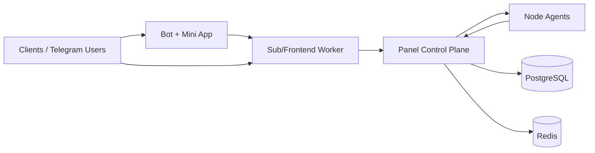

# CARAMBA

CARAMBA is an installer-first Rust platform for running censorship-resistant VPN infrastructure with a single control plane, distributed workers, and Telegram-facing client UX.

It is built for operators who need reliable node orchestration, subscription delivery, and fast rollout/upgrade workflows without manual server babysitting.

## Install (One Command)

```bash
curl -fsSL https://raw.githubusercontent.com/semanticparadox/caramba/main/scripts/install.sh | sudo bash
```

After install, the `caramba` binary becomes your control entrypoint for install, upgrade, diagnostics, restore, and uninstall.

## What CARAMBA Does

- Provisions and manages VPN nodes (pending -> active lifecycle).
- Generates and syncs Sing-box configs from templates/inbounds.
- Runs SNI discovery + pool management + pin/block workflow.
- Tracks node telemetry (latency, load, hardware stats, speed tests).
- Handles subscriptions, plans, promo flows, and user lifecycle.
- Integrates Telegram bot + Mini App for client self-service.
- Supports hub and distributed topologies with role-based installers.
- Ships release rollouts for panel/node/sub/bot through installer flow.

## Deployment Modes

| Mode | Description | Typical Use |
| --- | --- | --- |
| `Hub` | Panel + Sub (and optional Bot) on one host | Fast launch / staging |
| `Distributed` | Panel control-plane separated from Sub/Bot workers and external nodes | Production scale |

Both modes are managed via installer roles (`hub`, `panel`, `node`, `sub`, `bot`) and can be switched as infrastructure grows.

## Architecture (High Level)



## Installer-First Workflow

### Core commands

```bash
caramba install --hub
caramba install --panel
caramba install --node
caramba install --sub
caramba install --bot

caramba upgrade
caramba diagnose
caramba restore --file /path/to/backup.tar.gz
caramba uninstall
```

### Role install examples

```bash
# Node (use enrollment/join token from panel)
curl -fsSL https://raw.githubusercontent.com/semanticparadox/caramba/main/scripts/install.sh \
  | sudo bash -s -- --role node --panel "https://panel.example.com" --token "EXA-ENROLL-XXXX"

# Sub/frontend worker
curl -fsSL https://raw.githubusercontent.com/semanticparadox/caramba/main/scripts/install.sh \
  | sudo bash -s -- --role sub --panel "https://panel.example.com" --domain "sub.example.com" --token "<INTERNAL_API_TOKEN>"

# Bot worker
curl -fsSL https://raw.githubusercontent.com/semanticparadox/caramba/main/scripts/install.sh \
  | sudo bash -s -- --role bot --panel "https://panel.example.com" --bot-token "<BOT_TOKEN>" --panel-token "<INTERNAL_API_TOKEN>"
```

## Key Product Areas

### Infrastructure control
- Node onboarding with one-time install scripts.
- Inbound template management and sync.
- Port/SNI rotation and config regeneration.
- Node health, status, and rollout signals.

### Connectivity resilience
- Neighbor SNI scanning and candidate curation.
- Global SNI pool + blocklist handling.
- TLS/reality masking pipelines for anti-blocking deployments.

### Commercial and user operations
- Plans, subscriptions, promo center, transactions.
- Device/session tracking and admin-side controls.
- Telegram notifications (single user + broadcast).
- Mini App subscription flows (purchase, activate, retrieve links).

### Operations and upgrades
- Installer-managed upgrade path (no full reinstall required).
- Role-aware rollout metadata for node/sub/bot binaries.
- System logs, bot logs, and diagnostics endpoints.

## Workspace Layout

- `apps/caramba-panel` - Control plane (admin UI + API + orchestration)
- `apps/caramba-node` - Node agent
- `apps/caramba-sub` - Frontend/subscription edge worker
- `apps/caramba-bot` - Telegram bot worker
- `apps/caramba-installer` - Installer + upgrade tooling
- `apps/caramba-app` - Mini App frontend bundle
- `libs/caramba-db` - DB models, repos, migrations
- `libs/caramba-shared` - Shared contracts/configs

## Development

```bash
cargo check --workspace
cargo test --workspace
```

Run specific services locally:

```bash
cargo run -p caramba-panel
cargo run -p caramba-node
cargo run -p caramba-sub
cargo run -p caramba-bot
```

## Documentation

- `docs/DEPLOYMENT.md`
- `docs/CONFIGURATION.md`
- `docs/MODULES.md`
- `docs/API.md`
- `docs/DATABASE.md`
- `docs/DEVELOPMENT.md`

## CI/CD

GitHub Actions workflow: `.github/workflows/release.yml`

- Build + release is triggered on tags matching `v*`.
- Manual workflow dispatch is available for dry runs/build checks.

## License

Until a formal `LICENSE` file is added, repository contents should be treated as all-rights-reserved/source-available by default.
